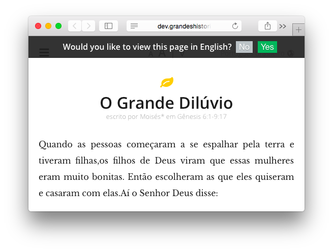

# acceptedlanguagesui.js

[](https://travis-ci.org/leighmcculloch/acceptedlanguagesui.js)

A simple JavaScript library that displays a `div` that offers the user the web page in one of it's alternate languages based off the visitors accepted languages.

This library does not translate your website, and only offers alternate versions of your website, as defined by `link` tags in the `head` of your web page. See the usage below for an example.

Dependent on [acceptedlanguages.js](https://github.com/leighmcculloch/acceptedlanguages.js).



## Install

### Bower

```bash
bower install acceptedlangaugesui
```

### NPM

```bash
npm install acceptedlanguagesui --save
```

### Manual

Download [acceptedlanguages.min.js](https://github.com/leighmcculloch/acceptedlanguages.js/blob/master/dist/acceptedlanguages.min.js) and [acceptedlanguagesui.min.js](dist/acceptedlanguagesui.min.js).

## Usage

### Globals

Include `acceptedlanguages.js` and `acceptedlanguagesui.js` into the page and call `display`.

```html
<html lang="en">
  <head>
    <link rel="alternate" hreflang="pt-BR" href="..." />
    <link rel="alternate" hreflang="es" href="..." />
    <link rel="alternate" hreflang="en" href="..." />
    <script src="acceptedlanguages.js"></script>
    <script src="acceptedlanguagesui.js"></script>
    <script type="text/javascript">
      window.onload = function() {
        acceptedlanguagesui.display();
      };
    </script>
  </head>
  <body>
  </body>
</html>
```

If the visitor is viewing the `en` version of the page, and the browser is configured with the languages `pt, zh-Hans, en-US`, they will be offered to switch to `pt-BR`.

### RequireJS

Include the library and then use as a dependency:

```javascript
define(['acceptedlanguagesui'], function(acceptedLanguagesUI) {
  acceptedlanguagesui.display();
});
```

## Browser Compatibility

All browsers supporting ECMAScript 5: Chrome, Safari, Firefox, IE9, etc. If you need to support older browsers use [es5-shims](https://github.com/es-shims/es5-shim) to get the following:
* `Array.forEach`
* `Array.filter`
* `Array.map`
